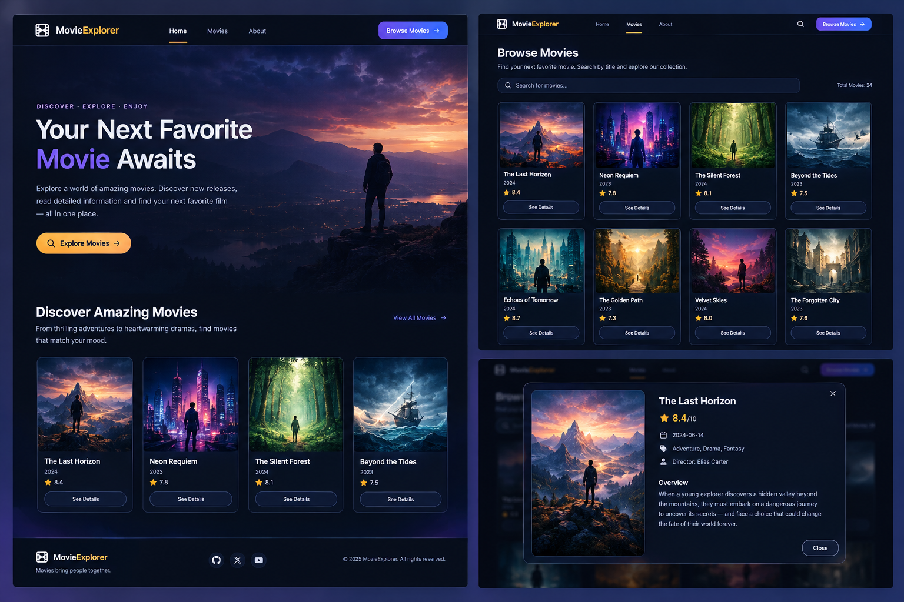

# 🎬 Movie Explorer

A modern and responsive **Movie Explorer** built with React and Vite that lets users discover TV shows, search for titles, and view detailed information in an interactive modal.

The application uses the **TVMaze API** to fetch show data and provides a clean dark-themed interface for browsing and discovering new favorites.

## 🌐 Live Demo

👉 **[Visit Movie Explorer](https://movie-explorer-bd.vercel.app/)**

## 📸 Project Preview



## ✨ Features

- 🎬 **Browse Shows** — Explore a collection of shows fetched from the TVMaze API.
- 🔍 **Search by Title** — Search for shows by entering a title in the search bar.
- ⭐ **Movie/Show Ratings** — Display the available rating for each show.
- 📅 **Premiered Date** — Show the original premiered date.
- 🏷️ **Genres & Type** — Display genres and the type of each show.
- 📖 **Detailed Information** — Open a modal to view detailed information and the show's summary.
- 📱 **Responsive Design** — Works across desktop and mobile screen sizes.
- ⚡ **Loading State** — Displays a loading message while data is being fetched.
- 🧭 **Client-Side Routing** — Separate Home and Movies pages using React Router.
- 🎨 **Dark UI** — Modern dark-themed interface built with Tailwind CSS.

## 🛠️ Tech Stack

- **React 19** — Frontend UI library
- **Vite** — Development server and build tool
- **JavaScript (ES6+)** — Application logic
- **React Router** — Client-side routing
- **Tailwind CSS 4** — Styling
- **React Icons** — Icons and UI elements
- **TVMaze API** — Movie/TV-show data source

The current project dependencies confirm React 19.2.8, React Router 8.4.0, Tailwind CSS 4.3.3, React Icons 5.7.0, and Vite 8.3.0.

## 📦 Dependencies

### Production Dependencies

```json
{
  "@tailwindcss/vite": "^4.3.3",
  "react": "^19.2.8",
  "react-dom": "^19.2.8",
  "react-icons": "^5.7.0",
  "react-router": "^8.4.0",
  "tailwindcss": "^4.3.3"
}
```

### Development Dependencies

```json
{
  "@eslint/js": "^10.0.1",
  "@types/react": "^19.2.18",
  "@types/react-dom": "^19.2.7",
  "@vitejs/plugin-react": "^6.1.1",
  "eslint": "^10.10.0",
  "eslint-plugin-react-hooks": "^7.1.1",
  "eslint-plugin-react-refresh": "^0.5.6",
  "globals": "^17.12.0",
  "prettier": "^3.9.7",
  "prettier-plugin-tailwindcss": "^0.8.1",
  "vite": "^8.3.0"
}
```

These versions are taken from the repository's current `package.json`.

## 📋 Prerequisites

Before running the project locally, make sure you have:

- **Node.js** installed
- **npm** installed
- **Git** installed
- A modern web browser

Check your installed versions:

```bash
node --version
npm --version
git --version
```

## ⚙️ Installation

### 1. Clone the repository

```bash
git clone https://github.com/NazmulHossain2905/MovieExplorer.git
```

### 2. Navigate to the project

```bash
cd MovieExplorer
```

### 3. Install dependencies

```bash
npm install
```

### 4. Start the development server

```bash
npm run dev
```

Vite will provide the local development URL in your terminal, usually:

```text
http://localhost:5173/
```

Open the URL in your browser to start exploring movies.

## 🏗️ Production Build

Create an optimized production build:

```bash
npm run build
```

Preview the production build locally:

```bash
npm run preview
```

## 🧹 Linting

Run ESLint with:

```bash
npm run lint
```

The repository currently provides these scripts:

| Command           | Description                  |
| ----------------- | ---------------------------- |
| `npm run dev`     | Start the development server |
| `npm run build`   | Create a production build    |
| `npm run lint`    | Run ESLint                   |
| `npm run preview` | Preview the production build |

## 🔐 Environment Variables

No environment variables are required for the current project.

The application directly communicates with the public **TVMaze API**, so there is currently no API key or `.env` configuration needed.

You do **not** need to create a `.env` file to run the project.

## 🔌 API

Movie/show data is fetched from the **TVMaze API**.

### Get All Shows

```text
https://api.tvmaze.com/shows
```

The application uses this endpoint to load the available shows.

### Search Shows

```text
https://api.tvmaze.com/search/shows?q={searchQuery}
```

The search page uses this endpoint when the user enters a search query.

For more information:

**[TVMaze API Documentation](https://www.tvmaze.com/api)**

## 🧭 Application Routes

The application currently has two main routes:

| Route     | Description                                    |
| --------- | ---------------------------------------------- |
| `/`       | Home page with hero section and featured shows |
| `/movies` | Browse and search shows                        |

These routes are configured using React Router.

## 🎬 Movie Details

Each movie/show card displays basic information such as:

- Title
- Poster
- Language
- Rating
- Premiered date
- Genres

Users can click **See Details** to open a modal containing more information.

The details modal additionally displays:

- ⭐ Rating
- 📅 Premiered date
- 🏷️ Genres
- 🎭 Show type
- 📖 Overview/summary

The summary returned by TVMaze is rendered as HTML inside the details modal.

## 📁 Project Structure

```text
MovieExplorer/
│
├── public/
│
├── src/
│   ├── components/
│   │   ├── DiscoverAmazingMovies.jsx
│   │   ├── Footer.jsx
│   │   ├── Hero.jsx
│   │   ├── MovieCard.jsx
│   │   ├── MovieDetailsModal.jsx
│   │   ├── MovieGrid.jsx
│   │   └── Navbar.jsx
│   │
│   ├── pages/
│   │   ├── Home.jsx
│   │   └── Movies.jsx
│   │
│   ├── App.jsx
│   ├── index.css
│   └── main.jsx
│
├── .gitignore
├── .prettierrc
├── eslint.config.js
├── index.html
├── package.json
├── package-lock.json
├── vite.config.js
└── README.md
```

The main application uses separate Home and Movies pages, with reusable components for the navigation, hero section, movie grid, movie cards, details modal, and footer.

## 🧠 React Concepts Used

This project demonstrates several important React concepts:

- Functional components
- `useState`
- `useEffect`
- Props
- Conditional rendering
- `.map()` for rendering lists
- Event handling
- API data fetching
- Loading states
- React Router
- Component composition

For example, the Movies page uses `useState` to manage movies, loading status, and the search query, while `useEffect` fetches new data whenever the search query changes.

## 🚀 Future Improvements

Some possible improvements for future versions:

- 🔎 Debounced search
- ❤️ Favorite movies
- 📌 Watchlist functionality
- 🎞️ Movie/show trailers
- 📄 Pagination or infinite scrolling
- ⚠️ Better API error handling
- ⏳ Skeleton loading UI
- 🌙 Theme customization
- 📱 Further mobile UI improvements
- 🔗 Shareable movie details
- 🎭 Cast information
- 🎬 Similar/recommended shows

## 🔗 Useful Links

- 🌐 **[Live Demo](https://movie-explorer-bd.vercel.app/)**
- 💻 **[GitHub Repository](https://github.com/NazmulHossain2905/MovieExplorer)**
- 🎬 **[TVMaze API](https://www.tvmaze.com/api)**
- ⚛️ **[React Documentation](https://react.dev/)**
- 🧭 **[React Router Documentation](https://reactrouter.com/)**
- ⚡ **[Vite Documentation](https://vite.dev/)**
- 🎨 **[Tailwind CSS Documentation](https://tailwindcss.com/docs)**
- 🧩 **[React Icons](https://react-icons.github.io/react-icons/)**

## 👨‍💻 Author

**Nazmul Hossain**

- GitHub: [@NazmulHossain2905](https://github.com/NazmulHossain2905)
- Repository: [MovieExplorer](https://github.com/NazmulHossain2905/MovieExplorer)

---

**Built with ❤️ using React, Vite & Tailwind CSS.**
